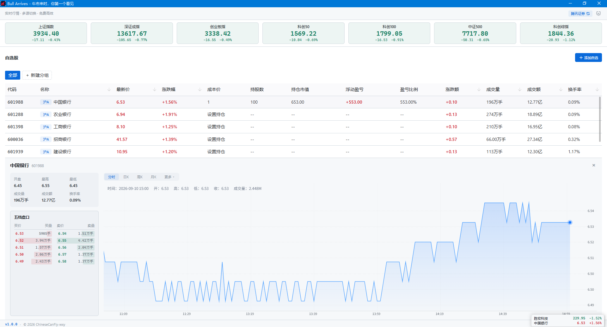
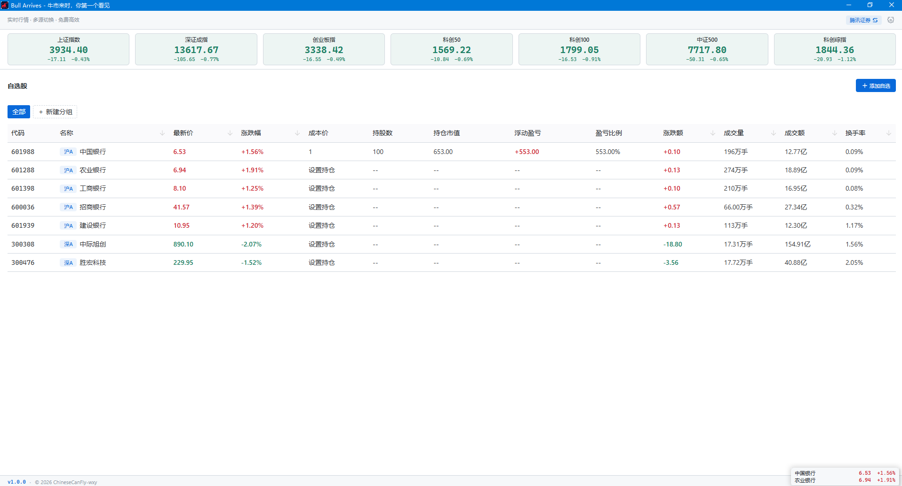

# Bull Arrives

> 🐂 **牛市来时，你第一个看见**

  桌面级 A 股实时行情监控 · 免费 · 轻量 · 零打扰
   
  基于 <a href="https://github.com/Leaderxin/quant-desktop">Leaderxin/quant-desktop</a> 二次开发 · 原作者 <a href="https://github.com/Leaderxin">@Leaderxin</a>

---

## 📌 v1.2.0 更新要点

> 本次更新聚焦"看图更准，按键更顺手"。

### 📈 分时图也能看到涨跌幅

之前分时图悬停只有开高低收和成交量，**没有涨跌幅**。现在补上了 —— 并且是按**昨收价**计算（交易软件口径），而不是相邻两分钟的微小波动，红涨绿跌着色。

- 股票详情：直接取行情里的昨收
- 指数详情：用「最新价 − 涨跌额」反推昨收

### ⌨️ 分组快捷键改成"录制式"

- **直接按键就能录** —— 点一下方框，按下 `Ctrl`+`Alt`+`←` 这样的组合即可，不用再手打字符串
- **可以清空** —— 点「清空」即停用该方向，留空不会注册、也不占用系统快捷键
- **保存前查冲突** —— 依此校验：必须含修饰键 → 系统保留组合（`⌘Q` / `⌘W` / `Win+L` 等）→ 与另一方向重复 → 与悬浮窗快捷键重复 → 交系统注册；被占用时直接给出中文原因，**旧快捷键保持不变**
- **看得见是否生效** —— 面板回读真实注册结果，显示「已生效」或「未生效（可能被其他程序占用）」，不再出现"保存成功却没反应"
- **macOS 适配** —— 按下的 `⌘` 正确识别为 `Super`，快捷键统一按 `⌃⌥⇧⌘` 符号展示（悬浮窗快捷键同步）

---

## 📌 上一版本 v1.1.0

> 本次更新聚焦"休市也别浪费，看盘更顺手"。

### 🕐 行情时间限制总开关

设置 → 行情里新增一个**总开关，默认关闭**：

- **关闭（默认）** —— 全天获取行情，盘前 / 午休 / 休市自动降低轮询频率，不会因为怕"超时"而漏掉盘后异动
- **开启** —— 严格只在下方配置的时段内请求行情，其余时间展示最后一次有效行情

旧版本已保存的时段配置会**原样保留**，升级后默认不生效，需要时手动打开即可。

### 📈 休市也能看到收盘行情

- **指数也做持久化了** —— 以往重启后指数栏是空的，现在休市或重启都能立刻看到最后一次有效指数
- **不再清空界面** —— 时间限制生效期间只是停止联网，自选股和指数的最后报价照常显示，不会退回昨天的数据
- **防止行情回退** —— 缓存加入时序校验，迟到的旧响应不会覆盖更新的报价

### 🪟 悬浮行情条更灵活

- **轮播模式** —— 可自定义每页展示数量（1–20 只），鼠标悬停暂停
- **固定模式** —— 一次展示当前分组全部股票，不再自动翻页，适合多屏或大屏常驻
- **窗口高度自适应** —— 悬浮条按行数自动变高，超出屏幕时内部滚动，拖动后位置始终在可见范围内

### 📱 小窗口也能好好看盘

- 窗口缩小时详情面板转为**上下排列**，变矮时 K 线不再被挤掉，详情区域内部可滚动
- 图表高度**随窗口自适应**，拖动窗口时画布实时重绘
- K 线悬停提示改为**固定展示**，贴近图表边缘、窗口较小时都完整可见，并补回成交额字段

### 🔗 其他

- 状态栏新增常驻 **GitHub 入口**，支持键盘聚焦
- 合入 [PR #1](https://github.com/ChineseCanFly-wxy/bull-arrives/pull/1)：macOS 点击 Dock 图标恢复主窗口、休市期间自选股搜索可用、更新代理探测更准确

---

## 🆕 本版本新增

> 这一节是本仓库在原项目基础上的扩展，也是本次开发的主要工作。

### 📁 自选股分组

自选股一多就乱？现在可以分组建管。

- 新建 / 重命名 / 删除分组，顶部工具栏一键切换
- **组内独立排序**，调整某组的顺序不影响其他组
- 股票可自由在组间移动
- **全局快捷键**循环切换分组（上/下一组，首尾环绕）

### 💼 持仓管理

不只是看行情，还能盯自己的仓位。

- 录入**每股成本价**与**持仓股数**
- 实时计算**持仓市值**、**浮动盈亏**、**盈亏比例**，随行情自动刷新
- 持仓按股票保存、跨分组共享

### 🔔 行情提醒

不用一直盯着屏幕，到价了它会告诉你。

- **涨跌幅提醒** —— 按昨收价计算，设定阈值（如 `+5%` 提示、`-5%` 预警）
- **固定价格提醒** —— 设定目标价，**向上穿越**或**向下穿越**时触发
- **三种重复方式** —— 每日一次 / 重新穿越 / 冷却间隔（1–1440 分钟）
- 每只股票可独立配置，规则可暂停而不删除

### 🪟 桌面提醒窗

独立于主窗口的提醒窗口，不打断你手头的事。

- **始终置顶**、无边框、不占任务栏
- 多条提醒**自动排队**，逐条展示不堆叠
- 点击提醒**直接跳转主窗口**
- 主窗口关着也能收到（托盘常驻）

### 📜 提醒记录

错过的提醒，回头还能查。

- 记录标题、正文、时间以及系统/桌面通道状态
- 保留本次运行最近 50 条，可一键清空
- 清空只影响展示历史，不会重置规则状态

### ⚙️ 偏好设置面板

原本散落在各处的设置项，现在集中管理。

- **行情** —— 刷新间隔（自动 / 1–60 秒固定）、**行情获取时段自定义**（最多 8 段）、额外休市日期
- **提醒** —— 总开关、通知身份注册、桌面兜底、测试通知
- **悬浮窗** —— 分组快捷键、显隐快捷键、**透明度**、**单色显示**
- **系统** —— 开机自启、运行模式、**主窗口打开大小**

---

## ⚡ 性能

### 启动即见行情

行情数据实时写入本地缓存，应用启动时**直接读取缓存渲染界面** —— 打开就能看到上次的报价，不必先等网络请求返回，数据到了再静默刷新。

### 只看你关心的，不多请求一条

**这是本版本相比原版最明显的差异。**

分组之后，程序**只请求当前分组**中的股票：

| 场景 | 原版 | 本版本 |
|---|---|---|
| 自选 200 只，此刻只看其中 10 只 | 轮询全部 200 只 | 只轮询当前分组的 10 只 |

自选股越多、分组越细，省下的请求量与带宽越可观 —— 换来更少的等待、更低的资源占用，以及更清爽的行情刷新。

### 不交易就不打扰

- **自适应轮询** —— 开盘快速探测确认活跃度，连续无变化自动降到约 30 秒
- **交易时段感知** —— 盘前约 5 秒 / 午休约 10 秒 / 休市约 30 秒，节假日智能休眠
- **请求时段外完全静默** —— 可选的时间限制开关，开启后时段外不发起任何网络行情请求，已有缓存照常显示（默认关闭，全天获取 + 自动降频）

### 刷新不打断操作

- 分时图**增量更新**，曲线平滑延伸，不整图重绘、不闪烁
- 五档盘口 3 秒静默刷新，不干扰你正在进行的操作
- 图表按周期采用不同刷新节奏（分时 5s / 日 K 30s / 周月 K 60s）

---

## 📊 核心功能

### 实时行情 + 大盘指数

- **自选股批量刷新** —— 现价、涨跌幅、涨跌额、开/高/低、成交量、成交额、换手率
- **七大指数同步展示** —— 上证、深证、创业板指、科创 50、科创 100、中证 500、科创综指
- **持仓列** —— 成本价、持股数、持仓市值、浮动盈亏、盈亏比例，与行情同步刷新

### 专业图表分析

- **分时走势图** —— 1 分钟粒度，实时增量更新不闪烁，悬停显示**分时涨跌幅**（以昨收为基准）
- **K 线图** —— 分时 / 1 分 / 5 分 / 15 分 / 30 分 / 60 分 / 日 / 周 / 月，覆盖超短线到中长线
- **技术指标** —— 主图 **MA / BOLL**，副图 **VOL / MACD / KDJ / RSI** 一键切换
- **悬停看明细** —— 鼠标移到 K 线上显示日期、开高低收、**涨跌幅**、成交量、成交额
- **左滑加载历史** —— 向左滑动查看更早数据
- **随窗口自适应** —— 窗口拉大拉小图表实时重绘，小窗口自动切换上下布局
- **五档盘口** —— 买一至买五、卖一至卖五，3 秒静默刷新

### 自选股管理

- **多种搜索方式** —— 6 位代码、部分代码、**中文名称**、**拼音缩写**
- 添加、删除、排序（置顶 / 上移 / 下移），右键菜单快捷操作
- 任意列排序，支持跨数据源智能回退
- **键盘操作** —— `Enter` / `A` 打开提醒设置、`空格` 展开详情、双击行快捷操作

### 双数据源自动切换

顶栏一键切换腾讯证券（默认）或新浪财经（备用），切换后即时刷新，零等待。

---

## 🌟 特色功能

### 🖱️ 可拖拽的浮动行情条

桌面右下角常驻一个迷你行情条（默认 230 × 38）：

- ✅ **始终置顶**在所有窗口之上，无边框、不占任务栏
- ✅ **两种展示模式** —— **轮播**（每 3 秒翻页，数量 1–20 只可选）或**固定**（一次展示当前分组全部股票，不翻页）
- ✅ **高度自适应** —— 按展示行数自动变高，超出屏幕时内部滚动
- ✅ **鼠标悬停暂停**，方便仔细看某只
- ✅ **拖拽移动**，位置自动保存
- ✅ **点击恢复主窗口**
- ✅ **单色显示**模式 + **透明度**调节（5%–100%）

> 💡 **典型场景**：把行情条拖到屏幕角落或副屏边缘，工作时余光一扫就能掌握自选股动态。比任何"老板键"都优雅 —— 因为**它看起来就像桌面的一部分**。

### 📌 系统托盘常驻

- 关闭主窗口**不退出程序**，自动隐藏到托盘
- 左键托盘图标 → 显示/隐藏主窗口
- 右键菜单 → 显示主界面 / 切换行情条 / 检查更新 / 退出
- 支持**开机自启**

### 🧠 窗口位置记忆

主窗口位置和大小自动保存，重启恢复原位。更换显示器时智能检测边界。可选"记住上次窗口大小"，或固定为自定义尺寸（640–7680 × 480–4320）。

### ⚡ 离线缓存

行情自动写入本地缓存，重启时立即恢复上次报价。

### 🔄 应用内自动更新

Windows / Linux 版本支持**应用内自动更新** —— 发现新版本后按提示下载安装即可，无需手动去 GitHub 下载。交易时段内启动检查不会弹出提示，避免打断看盘。

### 📦 便携模式

放置一个 `portable.dat` 到 exe 同级目录即进入便携模式：所有数据（数据库、日志）写入同级 `data/`，不碰系统 `%APPDATA%`，适合 U 盘携带或多版本并存。

---

## 🎨 界面设计

- **深色 / 浅色主题**一键切换，主窗口与行情条同步
- **等宽数字字体**，价格和涨跌幅列完美对齐
- **A 股配色习惯** —— 红涨绿跌
- 界面简洁流畅，无冗余元素干扰

---

## 📦 安装与使用

### 下载

前往 [GitHub Releases](https://github.com/ChineseCanFly-wxy/bull-arrives/releases) 下载最新版本：

| 平台 | 安装包格式 |
|------|-----------|
| Windows | `.exe`（安装版）/ `.msi` / `.zip`（免安装绿色版） |
| macOS | `.dmg`（Intel + Apple Silicon 通用） |
| Linux | `.deb` / `.rpm` / `.AppImage` |

### 三步开始看盘

1. **安装并启动** —— 首次启动自动创建数据库和默认配置
2. **添加自选股** —— 点击"添加自选"，输入代码 / 中文名 / 拼音缩写搜索
3. **开始看盘** —— 主窗口查看完整行情，行情条常驻桌面

> 📖 **完整说明**：功能细节、设置项含义、常见问题排查，请见 [用户使用手册](docs/用户使用手册.md)。

---

## 🗺️ 路线图

### ✅ 已完成

**本仓库新增**

- [x] 自选股分组管理 + 分组快捷键
- [x] 持仓管理与浮动盈亏
- [x] 行情提醒（涨跌幅 / 固定价格 + 三种重复方式）
- [x] 桌面提醒窗与提醒记录
- [x] 偏好设置面板重构
- [x] 便携模式 + 自定义窗口尺寸

**v1.2.0**

- [x] 分时图悬停提示补上涨跌幅（以昨收为基准）
- [x] 分组切换快捷键改为录制式输入，支持一键清空停用
- [x] 快捷键保存前校验系统保留组合与内部重复，并回读真实生效状态
- [x] macOS 快捷键显示（⌃⌥⇧⌘）与 ⌘ → Super 映射

**v1.1.0**

- [x] 行情时间限制总开关（默认关闭，关闭时全天获取 + 休市自动降频）
- [x] 指数行情持久化缓存，休市 / 重启后仍展示最后有效数据
- [x] 主页面与详情响应式适配，图表尺寸实时跟随窗口
- [x] K 线悬停提示固定展示（含涨跌幅、成交额）
- [x] 状态栏常驻 GitHub 入口
- [x] 悬浮行情条轮播 / 固定模式 + 每页数量配置 + 高度自适应
- [x] 合入 PR #1：macOS Dock 激活、休市自选股搜索、更新代理探测

**继承自原项目**

- [x] 实时行情 + 七大指数
- [x] 分时图 + K 线图 + 技术指标
- [x] 五档盘口
- [x] 浮动行情条
- [x] 系统托盘常驻 + 开机自启
- [x] 深色 / 浅色主题
- [x] 窗口位置记忆 + 离线缓存
- [x] 自适应轮询 + 交易时段感知
- [x] 应用内自动更新

### 📋 规划中

- [ ] 自选股导入 / 导出（JSON / CSV）
- [ ] 港股 / 美股市场支持
- [ ] macOS 代码签名与公证

---

## 🤝 开源与贡献

Bull Arrives 完全开源，源码可见，自由使用、修改和分享。

- **GitHub 仓库**：[ChineseCanFly-wxy/bull-arrives](https://github.com/ChineseCanFly-wxy/bull-arrives)
- **Bug 反馈 & 功能建议**：欢迎提交 [Issue](https://github.com/ChineseCanFly-wxy/bull-arrives/issues)
- **想参与开发？** 欢迎提交 PR

### 致谢

本项目基于 [Leaderxin/quant-desktop](https://github.com/Leaderxin/quant-desktop) 二次开发。原作者 **[Leaderxin](https://github.com/Leaderxin)** 完成了行情采集、图表渲染、托盘常驻、浮动行情条等全部基础架构。

原项目采用 [PolyForm Noncommercial License 1.0.0](LICENSE) 发布，**仅限非商业使用**。

---

## 💬 结语

Bull Arrives 的核心理念是 **"不打扰的看盘"**：

> 不需要打开浏览器 · 不需要付费订阅 · 不需要笨重的客户端

一个安静的系统托盘图标 + 一个可拖拽的迷你行情条 + 需要时一键展开的完整看盘界面 —— **牛市来时，你第一个看见**。

如果觉得好用，欢迎给个 **Star ⭐** 支持一下！

---

  <b>Bull Arrives v1.1.0</b> — 牛市来时，你第一个看见。

