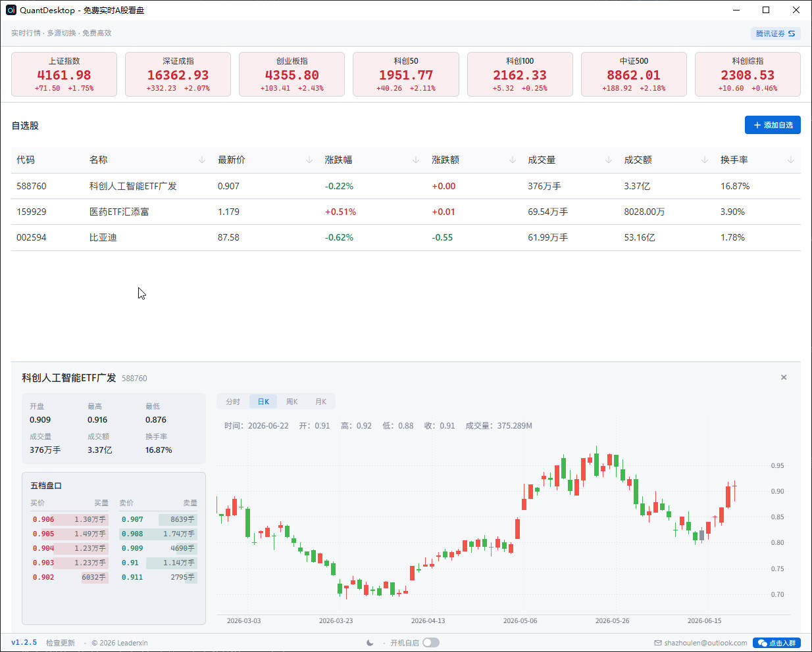
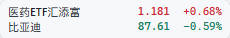
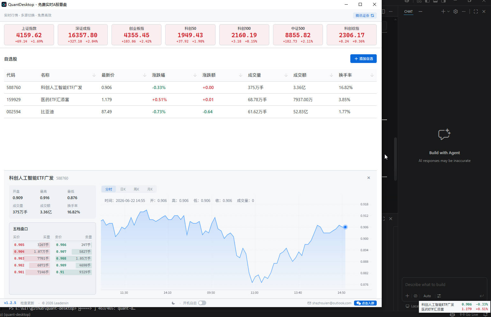

# QuantDesktop

> 🚀 **免费 · 专业 · 零打扰** —— 桌面级 A 股实时行情监控工具

  基于 <a href="https://github.com/Leaderxin/quant-desktop">Leaderxin/quant-desktop</a> 二次开发 · 原作者 <a href="https://github.com/Leaderxin">@Leaderxin</a>

---

## 🆕 本版本新增

> 这一节是本仓库在原项目基础上的扩展，也是本次开发的主要工作。

### 📁 自选股分组

自选股一多就乱？现在可以分组建管。

- 新建 / 重命名 / 删除分组，顶部工具栏一键切换
- **组内独立排序**，调整某组的顺序不影响其他组
- 自选股可自由在组间移动

### 💼 持仓管理

不只是看行情，还能盯自己的仓位。

- 录入**成本价**与**持仓数量**
- 实时计算**浮动盈亏**、盈亏比例，随行情自动刷新
- 与自选列表联动，持仓股一眼可辨

### 🔔 价格预警

不用一直盯着屏幕，到价了它会告诉你。

- 为任意自选股设置**上限 / 下限**预警
- 触发后弹出**桌面提醒窗**（见下）
- 支持多只股票、多条规则并存

### 🪟 桌面提醒窗

独立于主窗口的提醒窗口，不打断你手头的事。

- **始终置顶**、无边框、不占任务栏
- 多条提醒**自动排队**，逐条展示不堆叠
- 点击提醒**直接跳转主窗口**并定位到对应股票
- 主窗口关着也能收到（托盘常驻）

### 📜 通知历史

错过的提醒，回头还能查。

- 统一记录价格预警与系统通知
- 支持查询、清空
- 内存中保留最近 50 条，重启不丢关键信息

### ⌨️ 全局快捷键

不用找鼠标，一个组合键搞定。

- 一键**显示 / 隐藏浮动行情条**
- 组合键**可自定义**，冲突时自动提示
- 全局生效，任何应用前台时都能触发

### ⚙️ 设置面板

原本散落在各处的设置项，现在集中管理。

- **行情调度** —— 刷新频率、交易时段策略
- **窗口尺寸** —— 主窗口默认大小
- **全局快捷键** —— 自定义组合键
- **提醒与通知** —— 预警开关、通知方式、通知身份注册

---

## 📊 核心功能

### 实时行情 + 大盘指数

- **自选股批量刷新** —— 现价、涨跌幅、涨跌额、开/高/低、成交量、成交额、换手率，一览无余
- **七大指数同步展示** —— 上证、深证、创业板指、科创 50、科创 100、中证 500、科创综指实时更新
- **智能自适应轮询** —— 交易时段 2 秒快速刷新，盘前盘后自动降频，节假日智能休眠，不浪费带宽和电量

### 专业图表分析

- **分时走势图** —— 1 分钟粒度精细呈现，实时增量更新不闪烁，完整还原当日走势
- **K 线图（1 分钟 / 5 分钟 / 日 / 周 / 月）** —— 覆盖超短线到中长线全周期，蜡烛图严格遵循 A 股红涨绿跌习惯，主图支持 MA 均线 / BOLL 布林带一键切换，副图支持成交量（含 MA 均量线）和 MACD 指标一键切换，tooltip 悬停查看涨跌幅
- **K 线图左滑加载更多** —— 分钟级 K 线向左滑动可查看更早历史数据，日/周/月 K 线同样支持
- **五档盘口** —— 买一至买五、卖一至卖五实时展示，3 秒静默刷新不打断操作

### 自选股管理

- 添加、删除、排序（置顶 / 上移 / 下移），右键菜单快捷操作
- 输入 6 位股票代码即时搜索，支持跨数据源智能回退
- 按涨跌幅、价格、成交量、代码等任意列排序

### 双数据源自动切换

顶栏一键切换腾讯证券（默认）或新浪财经（备用），切换后即时刷新，零等待。

---

## 🌟 特色功能

### 🖱️ 可拖拽的浮动行情条

桌面右下角常驻一个迷你行情条：

- ✅ **始终置顶**在所有窗口之上，无边框设计，不占任务栏空间
- ✅ **每 3 秒自动轮播** 2 只自选股，显示股票名称、最新价和涨跌幅
- ✅ **鼠标悬停暂停**，方便你仔细看某只股票
- ✅ **直接拖拽**到桌面任意位置，丝滑零延迟
- ✅ **点击恢复主窗口**，快速切换到完整看盘界面
- ✅ **主题同步** —— 深色/浅色切换，行情条同步响应

> 💡 **典型场景**：把行情条拖到屏幕角落或副屏边缘，工作时余光一扫就能掌握自选股动态。比任何"老板键"都优雅 —— 因为**它看起来就像桌面的一部分**。

### 📌 系统托盘常驻

- 关闭主窗口**不退出程序**，自动最小化到系统托盘
- 左键托盘图标 → 显示/隐藏主窗口
- 右键菜单 → 显示主窗口 / 切换行情条 / 检查更新 / 退出
- 支持**开机自启**，设为默认后台常驻

### 🧠 窗口位置记忆

主窗口位置和大小自动保存，重启恢复原位。即使更换显示器也会智能检测边界，不会跑到屏幕外面去。

### ⚡ 离线缓存

行情数据自动写入本地缓存。重启应用时**立即恢复上一次报价**，无需等待网络请求 —— 打开就是最新行情。

### ⏰ 交易时段智能感知

| 时段 | 轮询频率 | 说明 |
|------|----------|------|
| 开盘快速探测 | 2 秒 × 3 次 | 确认交易是否活跃 |
| 正常交易 | 2 秒 | 实时跟踪价格变化 |
| 盘前 / 午休 | 5~10 秒 | 适度降频 |
| 连续无变化 | 30 秒 | 自动进入空闲态 |
| 节假日 / 周末 | 30 秒 | 智能休眠 |

自动更新提示也会在交易时段**智能抑制弹窗**，避免打断你盯盘。

---

## 🎨 界面设计

- **深色 / 浅色主题**一键切换，白天黑夜都护眼
- **等宽数字字体**，价格和涨跌幅列完美对齐
- **A 股配色习惯** —— 红涨绿跌，一目了然
- 界面简洁流畅，无冗余元素干扰

---

## 📦 安装与使用

### 下载

前往 [GitHub Releases](https://github.com/ChineseCanFly-wxy/quant-desktop/releases) 下载最新版本：

| 平台 | 安装包格式 |
|------|-----------|
| Windows | `.exe` / `.msi` / `.zip`（免安装） |
| macOS | `.dmg`（Intel + Apple Silicon 通用） |
| Linux | `.deb` / `.rpm` / `.AppImage` |

> 🔄 **自动更新**：Windows / Linux 版本支持应用内自动更新，无需手动下载。

### 三步开始看盘

1. **安装并启动** —— 首次启动自动创建数据库和默认配置
2. **添加自选股** —— 点击"添加股票"，输入 6 位代码（如 `600519` 贵州茅台），搜索并添加
3. **开始看盘** —— 主窗口查看完整行情，行情条常驻桌面后台监控

---

## 🗺️ 路线图

### ✅ 已完成

**本仓库新增**

- [x] 自选股分组管理
- [x] 持仓管理与浮动盈亏
- [x] 价格预警 + 桌面提醒窗
- [x] 通知历史记录
- [x] 全局快捷键
- [x] 设置面板重构

**继承自原项目**

- [x] 实时行情 + 七大指数
- [x] 分时图 + K 线图（1/5 分钟、日/周/月）+ 成交量 / MACD / BOLL 副图
- [x] K 线图左滑加载历史数据
- [x] 五档盘口（3s 静默刷新）
- [x] 浮动行情条（拖拽、轮播、主题同步）
- [x] 系统托盘常驻 + 开机自启
- [x] 自选股增删改查 + 排序 + 搜索
- [x] 深色 / 浅色主题
- [x] 窗口位置记忆 + 离线缓存
- [x] 自适应轮询 + 交易时段感知
- [x] 自动更新 + 交易时段弹窗抑制

### 📋 规划中

- [ ] 自选股导入 / 导出（JSON / CSV）
- [ ] 港股 / 美股市场支持
- [ ] macOS 代码签名与公证

---

## 🤝 开源与贡献

QuantDesktop 完全开源，源码可见，自由使用、修改和分享。

- **GitHub 仓库**：[ChineseCanFly-wxy/quant-desktop](https://github.com/ChineseCanFly-wxy/quant-desktop)
- **Bug 反馈 & 功能建议**：欢迎提交 [Issue](https://github.com/ChineseCanFly-wxy/quant-desktop/issues)
- **想参与开发？** 欢迎提交 PR，一起把工具做得更好

### 致谢

本项目基于 [Leaderxin/quant-desktop](https://github.com/Leaderxin/quant-desktop) 二次开发，原作者 **[Leaderxin](https://github.com/Leaderxin)** 完成了行情采集、图表渲染、托盘与行情条等全部基础架构。原项目采用 [PolyForm Noncommercial License 1.0.0](LICENSE) 发布，**仅限非商业使用**。

---

## 💬 结语

QuantDesktop 的核心理念是 **"不打扰的看盘"**：

> 不需要打开浏览器 · 不需要付费订阅 · 不需要笨重的客户端

一个安静的系统托盘图标 + 一个可拖拽到任意位置的迷你行情条 + 需要时一键展开的完整看盘界面 —— **这就是 QuantDesktop 给你的一切**。

如果你也是 A 股投资者，不妨试试看。完全免费，没有捆绑，不用注册。如果觉得好用，欢迎给个 **Star ⭐** 支持一下！

---

  <b>QuantDesktop v1.1.0</b> — 免费实时 A 股看盘，从桌面开始。

