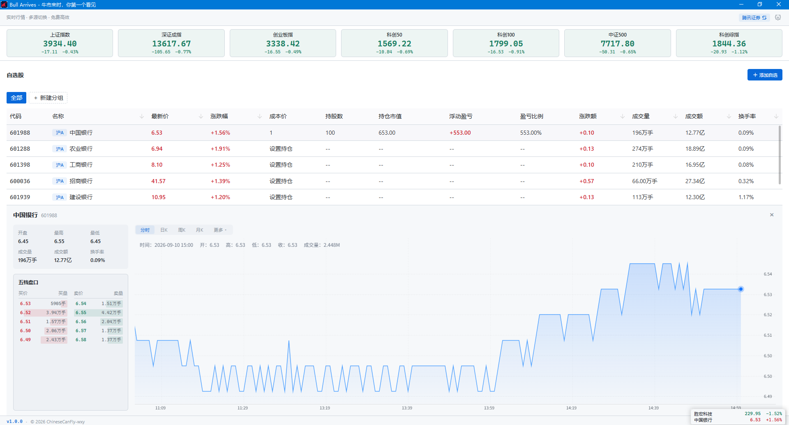
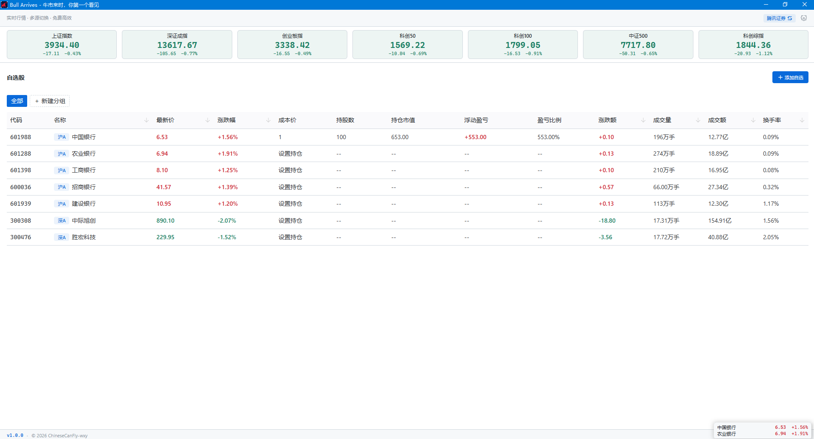

# Bull Arrives

> 🐂 **牛市来时，你第一个看见**

  桌面级 A 股实时行情监控 · 免费 · 轻量 · 零打扰
   
  基于 <a href="https://github.com/Leaderxin/quant-desktop">Leaderxin/quant-desktop</a> 二次开发 · 原作者 <a href="https://github.com/Leaderxin">@Leaderxin</a>
   
  本地历史数据引擎 <a href="https://github.com/hello245m/free-stockdb">hello245m/free-stockdb</a> · 原作者 <a href="https://github.com/hello245m">@hello245m</a>

---

## 当前版本

当前版本为 **v3.0.3**（2026-10-09）。本版补齐跨电脑研究环境，近期主线观察直接获取在线行情，并整理独立提醒与悬浮窗；下载请认准 [Releases](https://github.com/ChineseCanFly-wxy/bull-arrives/releases) 中非草稿、非预发布的版本。

### v3.0.3 更新

- **安装即带研究环境**：安装包和便携包包含私有Python、锁定依赖、研究脚本、冻结快照与模型。默认自动定位并修复失效的旧构建路径；StockDB仍由用户单独安装。
- **主线近期观察**：直接获取在线前复权行情；多年历史、历史ST与买卖价位研究继续使用StockDB。
- **各类提醒独立控制**：资讯与提醒统一六个入口，重要买卖与主线等提示使用独立置顶窗口；支持逐条确认、颜色透明度、拖动缩放，行情自选和拉伸按钮分开。
- **自动操作记录**：只保留后台任务时间与结果，数据更新异常统一归入；盘中确认专用功能已删除。

### v3.0.1 更新

- **资讯通知时间**：只通知本次启动后发布且时间有效的资讯，启动前与时间未核实的内容只归档，重启不补推旧消息。
- **自动操作记录**：在“资讯与提醒 → 自动操作”查看数据更新、模型检查、建账和主线扫描等后台结果；默认开启独立记录开关，最多保留本次运行200条，支持搜索和清空，连续相同内容合并。关闭只停止新增记录，不影响自动任务或买卖通知。

### v3.0.0 核心功能

- **资讯 AI 改为手动解读**：取消资讯自动解读与混合模式，保留用户点击生成；已保存解读仍可查看。
- **个股模型与形态研究**：模型证据卡、近期资讯原文、模型与反证解读放在同一入口；模型分数和 AI 确定性均不等于上涨概率。
- **技术组合研究**：固定12项候选，按历史顺序训练、选择和评估，记录市场状态、费用/延迟及同池排序；五年92份实际账户结果保留，当前未新增准入模型。见[本轮验收](docs/研究中心简化与嵌套研究-2026-10-04.md)。
- **量化跟随交易**：沿用五个冻结技术模型，各模型独立推荐数量与预算，默认2/3/3/5/2只，可调1—10只；排序模型5只采用已核对的每票10%、总预算50%，其他配置保留原8%基准。买卖操作单明确股数、限价和有效期，程序全自动下单，之后新盘口满足条件才模拟成交，开启通知后接收买卖结果，无需逐笔确认；200个仓位账本及默认选择独立核对；另完成每模型9套入场/退出假设和63个时点账本，大盘模型3只的条件入场通过复验并接入，其余未通过方案保留研究。见[跟随交易指南](docs/量化跟随交易-2026-10-04.md)。
- **研究中心模型账户**：历史回放、开启后的前向纸上观察、基本面时点研究及主线观察，保留现金、订单、持仓与通知当时证据。当前模型均未实盘准入；已弃用的实战 B 表策略未接入。
- **自动模型账户与日常界面**：A股交易日09:00更新StockDB，成功10分钟后自动检查原冻结模型；有合格候选时按各自推荐配置建独立账户，同模型账户持续复用，暂停或删除后不自动重新启用。资金预设及账户配置集中在模拟账户，研究中心直接切换现金、净值、持仓与成交，提醒只保留统一入口。具体操作见 [日常使用指南](docs/日常使用指南.md)。
- **市场主线**：全市场扫描后台持续、暂停取消在途处理、按已保存进度恢复；修复备用行情的非交易日日期错位，保留真实交易日缺失的拒绝。部分覆盖时仍展示通过个股核验的候选；强势但高于2ATR的板块标记等待回落。新增31行业、5套固定规则、跨2018—2026历史对照，未替换原默认或新增可交易模型，见 [主线研究结果](docs/市场主线与自动账户优化-2026-10-05.md)。
- **发版流程**：代码与更新说明先校验、提交，再推送版本标签，由 GitHub 打包；所有平台及更新产物验证通过后发布。维护者见 [发布流程](docs/发布流程.md)。

完整安装包和便携包自带**独立 Python、匹配的研究依赖、同版本研究程序、冻结模型与研究快照**，研究中心自动定位，无需填写开发机路径或安装 Python。冻结数据截至 2026-09-30，后续日期必须取得并核验真实行情。**StockDB 仍需自行安装**；市场主线近期板块扫描走在线数据源，长期个股历史研究使用 StockDB。自定义研究环境仍可在研究中心配置项目目录、Python、快照及指数文件。

> 想加什么可 [提 PR](https://github.com/ChineseCanFly-wxy/bull-arrives/pulls) 或 [开 Issue](https://github.com/ChineseCanFly-wxy/bull-arrives/issues)。

---

## 📌 最近两个正式版本

以下为历史版本说明；v3.0.0 核心功能继续保留，本次增量见顶部「v3.0.1 更新」。

### v3.0.0 · 2026-10-05

- **全自动量化跟随交易** —— 沿用五个冻结模型，按模型独立配置持股数量、仓位、账户与交易时段，自动生成买卖计划、模拟成交和通知。
- **研究中心与市场主线** —— 自动模型交易、手动条件提醒、研究记录和主线扫描统一管理；主线候选提供证据和参考策略，不改变原模型准入。
- **数据与界面重构** —— A股交易日自动维护 StockDB，保留实时行情兜底；新增中文雅致主题，统一账户、提醒、帮助和窄窗口布局。

### v2.2.6 · 2026-09-27

- **资讯列表新增「仅看 AI 解读」** —— 「市场资讯」与「本次提醒」下可勾选只看**已完成并保存**的 AI 解读；
  可与搜索词**叠加**使用，两条都不命中时会说明是筛选造成的（而不是笼统的「没有内容」）
- **从桌面提醒跳转时自动清掉筛选** —— 否则目标条目可能刚好被「仅看 AI 解读」挡住，
  跳过去什么也看不见

### v2.2.5 · 2026-09-27

- **新增「每日简报」** —— 盘前 09:10 / 盘后 15:15 各生成一份，汇总本机已存的资讯与提醒，
  按「重大 / 自选 / 其他」分组。**完全本地生成、不自动调用 AI**，也不额外发请求
- **新增「三种研究模式」** —— 把研究按时间尺度拆成日线波段 / 盘中择时 / 中长期，纯机械规则
  （均线 / VWAP / 量能）。盘中择时要求同时满足「突破前 30 根高点 + 量能 1.5 倍 + 站上 VWAP」；
  **定位是观察，不是可执行的买卖指令**，数据超 7 天会直接标记为过期。
  研究中心另加**设置向导**：历史数据 → Claude 连接 → 验证条件 → 第一次研究
- **新增「研究方向目录」** —— 内置有出处的研究方向（价值 + 低风险、低波红利、残差反转、业绩事件等），
  每条写明来源与可检验假设；开头即声明这些是**待复核方向、不是已证实在当前市场能赚钱的策略**。
  附历史检验脚本（12 只股票），本轮结论是三种原型**均未通过准入**，没有接进自动交易
- **修掉切换界面风格后样式不生效** —— scoped 样式里写成 `:global([data-style="…"]) .xxx`，
  `:global()` 只对括住的那段生效、后面的类名仍带 scoped 属性，整条规则匹配不到，
  换 trading / modern 后这些样式直接失效；统一改为 `html[data-style="…"]`

> 更早的版本（v1.0.0 – v2.2.4）见 [CHANGELOG](CHANGELOG.md) 与
> [Releases](https://github.com/ChineseCanFly-wxy/bull-arrives/releases)。

---

## 🔍 选股与量化

> 四大模块 + 一套重写过的数据层：全市场筛选器 / 推荐榜 / 个股量化评分与价格位 / 智能监控。

### 🔎 市场筛选

沪深普通股行情筛选，固定排除 ST、退市、北交所及 B 股：

- **明确的页面切换** —— 市场筛选与研究模型使用有当前标记的分段导航，记住上次页签。顶部切换、查询与关闭按钮、底部分页一直可见。
- **手动查询** —— 首次默认不限条件，后续恢复上次条件。选择“不限条件 / 流动性优先 / 今日活跃 / 温和上涨”只应用条件，点击查询才读取行情。
- **自定义条件管理** —— 价格、市值、成交额、换手率、涨跌幅及更多估值条件自由组合；行业、概念支持多选。条件可命名保存、覆盖、改名、删除。新的行情条件独立保存，旧研究策略不会自动恢复执行。
- **结果与条件对应** —— 条件调整后显示待查询；现有结果和翻页继续使用上次已提交条件，直到重新查询。
- **行业、概念和手动分析** —— 表格展示行情通道提供的分类，缺失时说明来源；每行可打开分析、查看走势、加入自选。AI 仅由用户点击生成。
- **按需量化排名** —— 默认未评分。可计算本页，或分批计算当前命中的全部股票并按同日技术状态分排名。显示进度、失败与日期边界，可停止；缺失/陈旧/异日数据不冒充当前分数。
- **数据源和分页** —— 自动 / 东方财富 / 新浪财经。更多条件中可调整每页数量，点击查询后生效；数据源不支持的条件会明确提示。

“研究模型”页现在可直接选择全部5项或单项冻结模型，点击“筛选符合条件的股票”推断最近完成日信号。各模型独立排名，行内支持分析、走势、自选和组合条件观察；任务可关闭页面后继续，应用退出后可续跑。观察时可同时开启原模型盘后更新，触发时证据保存在提醒记录。五项仍为研究模型，均未实盘准入。

技术状态评分与行情预设用于研究观察，不能视作经验证的盈利策略。冻结模型的真实收益标签与多年组合证据在独立的“研究模型”页查看。

### 🏆 推荐榜

从最活跃的一批股票里，按**多因子加权评分**排出 Top 榜单，一键加自选或查看深度分析。

### 📊 个股模型与形态研究

打开分析先显示零至一百的技术状态分与简短模型观点，详细内容按需展开。评分计算使用现有趋势、量能、动量、RSI 极值因子；分数不等于上涨概率。

- **模型证据与近期原文** —— 核对个股同日评分、冻结版本、多阶段收益、回撤与双成本表现，原文同时标注公开与采集时间。
- **手动 AI 解读** —— 点击生成才调用 Claude，解释当前观点、支持证据、等待条件与最强反证。每条判断附快照字段、数值与日期；可以继续针对性提问并查看真实输入和调用记录。
- **技术形态与规则对照** —— 趋势跟随、均值回归、放量突破用于描述当前形态和价格情景，可自动匹配或手动切换。界面明确区分本股回放门禁与多年、多股组合验证，三条规则未获多年盈利准入。
- **本股规则回放** —— 展示实际样本、收益、成本、回撤、因果检查和具体门禁原因；仅限本股数据证据，不自动选择历史收益最高的规则。
- **价格位与因子明细** —— 支撑压力、规则价位、因子说明和指标快照均可展开核对。简短问号说明使用悬停/键盘提示。

当前冻结模型仍为研究观察，未获得生产或实盘准入。具体步骤见 [日常使用指南](docs/日常使用指南.md)。

### 🎯 智能监控

在自选股上开启监控后，**不用再手动填止损止盈价** —— 程序按 ATR（真实波幅均值）自动计算合理位置并盯盘提醒。

- **可以随时停止 / 恢复** —— 停止只翻开关：止损止盈位、触发状态全部留着，恢复后按原价位继续判断。
  与「删除」是两件事（删除才是真的不再监控）。**「刷新」重算价位不会把停掉的监控悄悄打开**
- **可以删除** —— 自选股右键菜单与「持仓监控」里都能删。自选股表的「监控」列直接显示
  **监控中 / 已停止 / 已止损 / 已止盈**，右键菜单按当前状态给出 开启 / 停止·恢复 / 删除监控
- **「持仓监控」是统一的监控管理页** —— 顶部输入代码或名称即可搜全市场添加（不输入时下拉里是自选股），
  支持关键词筛选与「全部 / 监控中 / 已停止」切换，每行可就地 停止|恢复 · 刷新 · 删除

### 🛡️ 数据层重写：多通道自动回退

真机实测发现单一数据源存在**间歇性阻断与 IP 限流**，因此数据层改为多通道：

| 数据 | 主力 | 兜底 |
|---|---|---|
| 全市场快照 | 东方财富（字段最全，含量比） | 新浪财经 |
| 日 K 线 | 腾讯财经（前复权） | 新浪财经 → 东方财富 |

通道故障自动降级并回传提示（如「当前数据源不提供量比，该条件已自动忽略」），**不再整页报错**。一字板判定按板块区分涨跌幅限制（主板 10% / 创业板科创板 20% / 北交所 30%），阈值统一取自 `market_rules`，与模拟撮合同源；**主板 ST / *ST 自 2026-07-06 起由 5% 放宽到 10%**，口径已同步，不会再把 ST 的普通波动误判成封板。

### 🩺 可诊断性

- 系统页显示**版本 / 构建时间 / 程序位置**，一眼确认运行的是不是最新版
- 新增前端日志通道：界面侧的问题会写入日志文件，远程排查不用来回截图

---

## 🆕 自选股与提醒

> 这一节是本仓库在原项目基础上的扩展：自选股分组、持仓、提醒体系与设置面板。

### 📁 自选股分组

自选股一多就乱？现在可以分组建管。

- 新建 / 重命名 / 删除分组，顶部工具栏一键切换
- **组内独立排序**，调整某组的顺序不影响其他组
- 股票可自由在组间移动
- **全局快捷键**循环切换分组（上/下一组，首尾环绕）

### 💼 持仓管理

不只是看行情，还能盯自己的仓位。

- 录入**每股成本价**与**持仓股数**
- 实时计算**持仓市值**、**浮动盈亏**、**盈亏比例**，随行情自动刷新
- 持仓按股票保存、跨分组共享

### 🔔 行情提醒

不用一直盯着屏幕，到价了它会告诉你。

- **涨跌幅提醒** —— 按昨收价计算，设定阈值（如 `+5%` 提示、`-5%` 预警）
- **固定价格提醒** —— 设定目标价，**向上穿越**或**向下穿越**时触发
- **三种重复方式** —— 每日一次 / 重新穿越 / 冷却间隔（1–1440 分钟）
- 每只股票可独立配置，规则可暂停而不删除

### 🪟 桌面提醒窗

独立于主窗口的提醒窗口，不打断你手头的事。

- **始终置顶**、无边框、不占任务栏
- 多条提醒**自动排队**，逐条展示不堆叠
- 点击提醒**直接跳转主窗口**
- 主窗口关着也能收到（托盘常驻）

### 📜 提醒记录

错过的提醒，回头还能查。

- 记录标题、正文、时间以及系统/桌面通道状态
- 保留本次运行最近 50 条，可一键清空
- 清空只影响展示历史，不会重置规则状态

### ⚙️ 偏好设置面板

原本散落在各处的设置项，现在集中管理。

- **行情** —— 刷新间隔（自动 / 1–60 秒固定）、本地历史数据连接与行情源选择；
  下方直接显示**交易日历的覆盖区间与来源**（指数行情推断 / 公告兜底），推断不出就明确提示
- **提醒** —— 总开关、通知身份注册、桌面兜底、测试通知
- **悬浮窗** —— 分组快捷键、显隐快捷键、**透明度**、**单色显示**、字体颜色（带外观预览）
- **外观** —— **界面风格**（原版 / 清晰现代）与**明暗模式**分开选，各自动保存、下次启动恢复
- **Agent** —— 可执行文件与工作目录、超时、**后台单次预算**（0.05–10 美元，只管后台调用）
- **系统** —— 开机自启、运行模式、**主窗口打开大小**，并显示**数据目录与设置数据库的实际路径**

保存语义也分清楚了：**开关类改动即时自动保存**；路径、超时、预算这类需要手输的，点对应按钮才落库。
保存过程中不允许关闭设置窗，有未保存的改动时会先提示确认。

---

## ⚡ 性能

### 启动即见行情

行情数据实时写入本地缓存，应用启动时**直接读取缓存渲染界面** —— 打开就能看到上次的报价，不必先等网络请求返回，数据到了再静默刷新。

### 只看你关心的，不多请求一条

**这是本版本相比原版最明显的差异。**

分组之后，程序**只请求当前分组**中的股票：

| 场景 | 原版 | 本版本 |
|---|---|---|
| 自选 200 只，此刻只看其中 10 只 | 轮询全部 200 只 | 只轮询当前分组的 10 只 |

自选股越多、分组越细，省下的请求量与带宽越可观 —— 换来更少的等待、更低的资源占用，以及更清爽的行情刷新。

### 不交易就不打扰

- **自适应轮询** —— 开盘快速探测确认活跃度，连续无变化自动降到约 30 秒
- **交易时段感知** —— 盘前约 5 秒 / 午休约 10 秒 / 休市约 30 秒，节假日智能休眠
- **请求时段外完全静默** —— 可选的时间限制开关，开启后时段外不发起任何网络行情请求，已有缓存照常显示（默认关闭，全天获取 + 自动降频）

### 刷新不打断操作

- 分时图**增量更新**，曲线平滑延伸，不整图重绘、不闪烁
- 五档盘口 3 秒静默刷新，不干扰你正在进行的操作
- 图表按周期采用不同刷新节奏（分时 5s / 日 K 30s / 周月 K 60s）

---

## 📊 核心功能

### 实时行情 + 大盘指数

- **自选股批量刷新** —— 现价、涨跌幅、涨跌额、开/高/低、成交量、成交额、换手率
- **七大指数同步展示** —— 上证、深证、创业板指、科创 50、科创 100、中证 500、科创综指
- **持仓列** —— 成本价、持股数、持仓市值、浮动盈亏、盈亏比例，与行情同步刷新

### 专业图表分析

- **分时走势图** —— 1 分钟粒度，实时增量更新不闪烁，悬停显示**分时涨跌幅**（以昨收为基准）
- **K 线图** —— 分时 / 1 分 / 5 分 / 15 分 / 30 分 / 60 分 / 日 / 周 / 月，覆盖超短线到中长线
- **技术指标** —— 主图 **MA / BOLL**，副图 **VOL / MACD / KDJ / RSI** 一键切换
- **悬停看明细** —— 鼠标移到 K 线上显示日期、开高低收、**涨跌幅**、成交量、成交额
- **左滑加载历史** —— 向左滑动查看更早数据
- **随窗口自适应** —— 窗口拉大拉小图表实时重绘，小窗口自动切换上下布局
- **五档盘口** —— 买一至买五、卖一至卖五，3 秒静默刷新

### 自选股管理

- **多种搜索方式** —— 6 位代码、部分代码、**中文名称**、**拼音缩写**
- 添加、删除、排序（置顶 / 上移 / 下移），右键菜单快捷操作
- 任意列排序，支持跨数据源智能回退
- **键盘操作** —— `Enter` / `A` 打开提醒设置、`空格` 展开详情、双击行快捷操作

### 双数据源自动切换

顶栏一键切换腾讯证券（默认）或新浪财经（备用），切换后即时刷新，零等待。

### 量化与选股

- **市场筛选** —— 4 个行情预设 + 可保存/改名/覆盖/删除的自定义条件，手动查询、固定导航分页、行业概念、按需全量技术评分
- **推荐榜** —— 活跃股多因子评分排行
- **个股量化评分** —— 4 个独立维度加权 0–100 分 + 指标快照 + **操作计划（买点/止损/止盈/仓位）、规则历史回测、价格位（支撑/压力）**
- **智能监控** —— ATR 自动止损止盈位盯盘，可随时停止 / 恢复（规则与价位保留）

---

## 🌟 特色功能

### 🤖 本地 Agent 解读（Claude Code）

把量化快照交给**你本机已装的 Claude Code** 去解读，而不是让应用自己去连模型：

- ✅ **不直连模型、不管理密钥** —— 应用不存也不读任何 API Key，也不维护第二套模型配置，
  直接复用你本机已有的 agent 能力
- ✅ **权限显式收敛** —— 不使用跳过权限模式（有测试守着）、工作目录隔离、
  **不读取也不改动**你的全局配置；固定单并发、超时可配（默认 90 秒，可设 15–300 秒）、
  可中断并回收整个进程树
- ✅ **可见的 Agent 工作台** —— 设置里就能探测本机安装位置、**主动测试连接**，
  并区分「找到安装文件」与「真的连上了」；快照失败时给出重新分析的指引，
  不再把你往登录 / 网络方向带偏
- ✅ **快照指纹修好了** —— 之前会误报「Agent 冻结快照指纹校验失败」：
  根因是 JSON 未启用精确浮点往返，高精度小数序列化再反序列化后数值位模式发生变化，
  重新计算的 SHA-256 就对不上了。修复后指纹稳定，**改数据的篡改用例依旧会失败**
- ✅ **诊断输出不外泄** —— 持续读取 CLI 输出，只在内存里保留有界尾部并返回固定分类提示；
  原始输出**不写日志、不落文件、不上界面**
- ✅ **两个入口** —— 单次单角色解读，以及多子代理团队分析（技术 / 资金 / 资讯等角色各跑一个进程再汇总）；
  两个入口不能同时跑，中止后不再启动后续角色，**风控失败也不会拿别人的意见充当最终结论**
- ✅ **交互终端：直接打开来聊** —— 除了「跑完给一份结论」，还可以把会话开在界面上：边跑边看事件流，
  随时**追问**、中途**取消**、关掉窗口后按任务 id **接回**同一个会话，上下文不丢。
  这条链路由你直接操作，**不套用后台那次 90 秒超时，也不占用单次预算**；
  手动触发的后台任务（个股解读 / 多角色研判 / 资讯摘要 / 动态筛选）仍受预算约束；资讯不自动生成 AI 解读
- ✅ **提示词外置** —— 基础 / 单股 / 技术 / 多方 / 空方 / 风控 / 资讯 / 连接 / 筛选 / 策略发现
  都在 `src-tauri/prompts/*.md`，改词不用改代码
- ✅ **预测会算总账** —— 每次预测落库，次日自动比对给出真实校准曲线，不靠"感觉准"
- ✅ **失败就退回去** —— 检测不到可执行文件时给明确指引；agent 失败只保留纯量化结果，不编结论

### 🔬 研究中心：从想法到前向证据

把一个想法推到有前向证据的全过程记录下来。新增模型研究只研究沪深普通 A 股、排除 ST 与北交所；下面的原有模拟账户仍按独立规则运行。模型观察不等于实战准入。

- ✅ **候选 → 观察 → 采纳** —— 完整台账；**研究实验的采纳与原有实战准入相互独立**，
  研究跑得通不代表实战验收通过
- ✅ **三种执行方式，账本各自独立** —— **实时前向**（默认，用委托建立**之后**收到的新鲜报价与
  对手盘口成交）／**日线前向**（已完成的日线信号，之后交易日按开盘价成交）／
  **并行对照**（同一候选建两个独立账户各按自己的口径跑，主考核看实时账户）。
  资金、订单、净值、回撤与样本**完全不合并**，不合并胜率、也不挑好的那边冒充整体成绩
- ✅ **实时口径从严** —— 买入参考卖一、卖出参考买一，**滑点后价格不得突破限价**；
  最优档可见量不足就**整笔等待**，不虚构排队成交与部分成交；委托当时的旧报价不能成交；
  当天未成交的限价委托直接过期，**不拿次日开盘或当天高低点事后补成交**
- ✅ **只交易 A 股** —— 代码限定沪深北股票，拒绝港美股、基金、债券与指数；时钟统一按北京时间

### 📈 模拟账户与胜率测算

用来回答「**我做出来的策略，胜率到底如何**」，全程自动：

- ✅ **独立账户** —— 与真实持仓数据完全分开，不下真实单、不接券商接口
- ✅ **撮合按 A 股规则** —— **涨跌幅与申报单位按代码所属板块自动判定**
  （主板 ±10%，含 2026-07-06 起并轨的主板 ST/*ST；创业板·科创板 ±20%；北交所 ±30%；
  科创板 200 股起、北交所 100 股起，超出部分 1 股递增，其余 100 股整手），
  **账户里配错的涨跌幅参数不会改变撮合结果**；退市整理期与上市未满 5 个交易日的股票不参与模拟
- ✅ **涨跌停怎么判** —— 停牌、**T+1 可用持仓**、可用资金不足都会被拦；
  以涨停 / 跌停价开盘但**盘中开板**（当日有振幅）的仍按开板价撮合，
  只有全天振幅为 0 的**一字板**才拒单
- ✅ **交易日历自己识别** —— 由上证指数日 K 与盘中实时报价推断，**跨年自动滚动**，
  不需要每年手工录入交易所休市日；行情完全不可用时才回退到公告日历，且明确报错而不是猜
- ✅ **成本可配** —— 手续费 / 印花税 / 过户费集中在配置里，不是写死的常数
- ✅ **只认未复权价** —— 本地历史库只有前复权 K 线时，自动任务**只生成指令、不改账本**；
  用复权价撮合会把涨跌停判定和成本一起算错
- ✅ **每笔都有出处** —— 记下触发来源（哪条策略 / 规则 / AI / 手动），否则事后答不出数字是谁跑出来的

### 🗂️ 本地历史数据（stockdb）

把长周期历史行情交给**你自己的本机数据库**，零网络、零限流：

- ✅ **默认关闭** —— 不开就完全不启动、不探测、不读取 stockdb；实时行情、盘口、监控、提醒
  一律不受影响
- ✅ **自动管理** —— 设置里选一次引擎（自动扫描候选，也可以手动浏览选 `stockdb.exe` 与
  `数据更新.exe`），之后**随应用启动自动拉起**；关到托盘不停，真正退出时才关闭
- ✅ **只碰自己的进程** —— 只管理**由它启动的**实例。你要是已经手工启动了服务，
  它直接用，但**不接管、也不结束**你的进程
- ✅ **不会弹浏览器 / 托盘** —— 拉起时固定带 `-d`（free-stockdb 官方选项 `-d: run as daemon`），
  以 daemon 方式在后台跑；不带这个参数它会走桌面模式、用 `ShellExecuteA` 打开自己的网页
  并挂一个托盘图标。应用只需要它的 HTTP 服务，所以**任何启动路径都不绕过 daemon 模式**
  （有单测守着，见 `stockdb::tests::engine_is_always_started_as_daemon`）
- ✅ **顶栏一键更新** —— 「更新本地数据」会先停掉自己启动的 stockdb → 弹出原生
  `数据更新.exe` 窗口 → 更新程序退出后自动把服务拉回来；更新期间从托盘退出会被拦下并提示等待
- ✅ **不可用时会说清楚** —— 单股分析回退在线短区间，并在结果里标明**来源与样本数**；
  推荐榜与批量筛选仍走全市场快照，**不会退化成逐只在线拉历史**（那样必被限流）
- ⚠️ 当前**只有 Windows** 支持自动管理；引擎是外部程序，**不含在安装包里**

引擎是 [hello245m/free-stockdb](https://github.com/hello245m/free-stockdb)（MIT）——
面向 A 股日K、分钟K 与 ETF 分钟数据的本地量化引擎，集成增量同步、本地缓存、复权、
批量查询、回测与指标计算。

### 🖱️ 可拖拽的浮动行情条

桌面右下角常驻一个迷你行情条（默认 230 × 38）：

- ✅ **始终置顶**在所有窗口之上，无边框、不占任务栏
- ✅ **两种展示模式** —— **轮播**（每 3 秒翻页，数量 1–20 只可选）或**自适应全显**（增删当前分组自选时自动调整高度，超过屏幕可用高度时滚动）
- ✅ **高度自适应** —— 按展示行数自动变高，超出屏幕时内部滚动
- ✅ **鼠标悬停暂停**，方便仔细看某只
- ✅ **拖拽移动**，位置自动保存
- ✅ **点击恢复主窗口**
- ✅ **悬停点「＋」直接管自选股** —— 弹出「快速自选」面板：搜代码或名称即加（回车加第一只），
  当前自选每行一个 × 直接删。**全程不用打开主界面**，适合「马上看一眼某只票、看完就删掉」
- ✅ **单色显示**模式 + **透明度**调节（5%–100%）

> 💡 **典型场景**：把行情条拖到屏幕角落或副屏边缘，工作时余光一扫就能掌握自选股动态。比任何"老板键"都优雅 —— 因为**它看起来就像桌面的一部分**。

### 📌 系统托盘常驻

- 关闭主窗口**不退出程序**，自动隐藏到托盘
- 左键托盘图标 → 显示/隐藏主窗口
- 悬浮窗右键 → 快速自选 / 展示设置；托盘右键 → 主界面 / 行情条 / 研究中心 / 市场筛选 / 模拟账户 / 设置 / 检查更新（安装版）/ 退出
- 支持**开机自启**

### 🧠 窗口位置记忆

主窗口位置和大小自动保存，重启恢复原位。更换显示器时智能检测边界。可选"记住上次窗口大小"，或固定为自定义尺寸（640–7680 × 480–4320）。

### ⚡ 离线缓存

行情自动写入本地缓存，重启时立即恢复上次报价。

### 🔄 应用内自动更新

Windows / macOS 安装版支持**应用内自动更新** —— 发现新版本后按提示下载安装即可，无需手动去 GitHub 下载。交易时段内启动检查不会弹出提示，避免打断看盘。

### 📦 便携模式

放置一个 `portable.dat` 到 exe 同级目录即进入便携模式：所有数据（数据库、日志）写入同级 `data/`，不碰系统 `%APPDATA%`，适合 U 盘携带或多版本并存。

---

## 🎨 界面设计

- **深色 / 浅色主题**一键切换，主窗口与行情条同步
- **等宽数字字体**，价格和涨跌幅列完美对齐
- **A 股配色习惯** —— 红涨绿跌
- 界面简洁流畅，无冗余元素干扰

---

## 📦 安装与使用

### 下载

前往 [GitHub Releases](https://github.com/ChineseCanFly-wxy/bull-arrives/releases) 下载最新版本；后续正式发布仅提供 Windows 和 macOS：

| 平台 | 安装包格式 |
|------|-----------|
| Windows x64 | `.exe`（安装版）/ `.zip`（免安装绿色版） |
| macOS | `.dmg`（Intel + Apple Silicon 通用） |

### 三步开始看盘

1. **安装并启动** —— 首次启动自动创建数据库和默认配置
2. **添加自选股** —— 点击"添加自选"，输入代码 / 中文名 / 拼音缩写搜索
3. **开始看盘** —— 主窗口查看完整行情，行情条常驻桌面

> 📖 **完整说明**：功能细节、设置项含义、常见问题排查，请见 [用户使用手册](docs/用户使用手册.md)。

---

## 🗺️ 路线图

> 待办清单在文首的 [规划中](#-规划中)。

### ✅ 已完成

**最近两个版本**

- **v2.2.5** —— 新增每日简报（盘前 / 盘后，本地生成、不调 AI）· 三种研究模式
  （日线波段 / 盘中择时 / 中长期，定位是观察而非指令）+ 研究设置向导 ·
  研究方向目录与历史检验脚本（三种原型本轮均未准入）· 修掉切换界面风格后样式不生效
- **v2.2.4** —— 修掉「打开软件一片空白」（根因是启动竞态：窗口先于后端就绪，
  `db` 状态注册提前 + 前端读设置增加启动重试）· 启动期间显示加载提示

**更早的版本**

- **v1.0.0 – v2.2.0** —— 全市场筛选器 / 推荐榜 / 个股量化评分 / 智能监控 / 数据层多通道回退 /
  行情提醒与桌面提醒窗 / 自选股分组与持仓 / 悬浮行情条增强 / 应用内自动更新 /
  本地 Agent 解读与研究中心 / 模拟买卖与策略验证闭环
  → 完整记录见 [CHANGELOG](CHANGELOG.md) 与 [Releases](https://github.com/ChineseCanFly-wxy/bull-arrives/releases)

**继承自原项目**

实时行情 + 七大指数 · 分时图与 K 线图 · 五档盘口 · 浮动行情条 · 系统托盘常驻与开机自启 ·
深浅色主题 · 窗口位置记忆与离线缓存 · 交易时段感知轮询 · 应用内自动更新

---

## 🤝 开源与贡献

Bull Arrives 完全开源，源码可见，自由使用、修改和分享。

- **GitHub 仓库**：[ChineseCanFly-wxy/bull-arrives](https://github.com/ChineseCanFly-wxy/bull-arrives)
- **Bug 反馈 & 功能建议**：欢迎提交 [Issue](https://github.com/ChineseCanFly-wxy/bull-arrives/issues)
- **想参与开发？** 欢迎提交 PR

### 致谢

本项目基于 [Leaderxin/quant-desktop](https://github.com/Leaderxin/quant-desktop) 二次开发。原作者 **[Leaderxin](https://github.com/Leaderxin)** 完成了行情采集、图表渲染、托盘常驻、浮动行情条等全部基础架构。

原项目采用 [PolyForm Noncommercial License 1.0.0](LICENSE) 发布，**仅限非商业使用**。

本项目的**本地历史数据**能力对接 [hello245m/free-stockdb](https://github.com/hello245m/free-stockdb) —— 面向 A 股日K、分钟K 与 ETF 分钟数据的本地量化引擎，集成增量同步、本地缓存、复权、批量查询、回测与指标计算。感谢原作者 **[hello245m](https://github.com/hello245m)** 开源，该项目以 **MIT 许可证**发布。

需要说明的是，该引擎是**独立运行在你本机的服务**：本仓库不分发它的任何代码或数据，只是把长周期历史行情接进来用；是否启用由你决定，数据版权、使用授权与再分发条件请自行向其仓库确认。

---

## 💬 结语

Bull Arrives 的核心理念是 **"不打扰的看盘"**：

> 不需要打开浏览器 · 不需要付费订阅 · 不需要笨重的客户端

一个安静的系统托盘图标 + 一个可拖拽的迷你行情条 + 需要时一键展开的完整看盘界面 —— **牛市来时，你第一个看见**。

如果觉得好用，欢迎给个 **Star ⭐** 支持一下！

---

  <b>Bull Arrives</b> — 牛市来时，你第一个看见。

